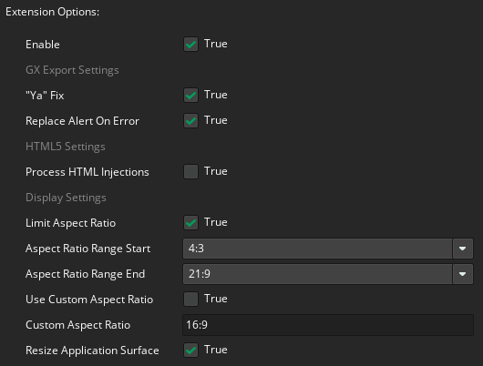

# NOGX
An extension for **Game Maker** designed to to make it easier to develop web games using the **GX target**.  
It removes the **GX platform** bindings in **GX target** replacing the `index.html` file, and also does other useful things.
> This extension can be useful even if you are not going to use GX target.

> Tested only on runtime `v2024.14.2.256` and `v2024.14.2.260`

### 1. Replacing `index.html` in GX target
The extension replaces the html file with its own `index.html`, which excludes bindings and functionality for the GX platform.
> The extension repackages the zip archive created for GX target.

### 2. Patching `runnner.js`
The extension fixes `runnner.js` to prevent errors or unwanted behavior on some web sites.
> `"Ya" Fix` and `Replace Alert On Error` options.

### 3. `webfiles` folder
This is a special folder in the root directory of your project where you can place web files.
The extension will include them in the **GX target** builds.
You can also use your custom `index.html` file located here, but it should be based on the default `index.html` file from the extension.

### 4. send_async_event_social
The extension adds the ability to send `ev_async_social` from JS to GM for the **GX target**.
The interface is identical to the one in **HTML5**, namely:
`GMS_API.send_async_event_social(map)`

### 5. Screen size control (works in other targets, not just GX)
The extension manages the screen size within the specified aspect ratio constraints and also prevents image blur, even in an HTML5 target.

### 6. HTML-Injections (works on GX and HTML5)
The extension implements HTML code injection independently, ignoring Game Maker's implementation! Most injectors described in the [Game Maker manual page](https://manual.gamemaker.io/beta/en/The_Asset_Editors/Extension_Creation/HTML5_Extensions.htm) are supported.

> Even if your version of Game Maker has a broken built-in HTML injection mechanism, the extension will still do it.

## Extension Options


## Functions
```gml
NOGX_get_canvas_width();
NOGX_get_canvas_height();
NOGX_get_pixel_ratio();
```
The last function will help you to fix incorrect `device_mouse_x_to_gui` and `device_mouse_y_to_gui` values on **HTML5 target**.  
Example:
```gml
// DRAW GUI EVENT
// draw touch points
for(var i=0; i<10; i++)
{
	var scl = NOGX_get_pixel_ratio(); // fix for HTML5 target
	draw_set_color(c_lime);
	if(device_mouse_check_button(i, mb_left)) {
		var px = device_mouse_x_to_gui(i) * scl;
		var py = device_mouse_y_to_gui(i) * scl;
		draw_circle(px, py, 16, false);
	}
}
```

## How to use
1. Add the extension to your project.
2. Set the extension settings you need.
3. Use `NOGX_get_canvas_width` and `NOGX_get_canvas_height` functions when controlling the size of the viewport and GUI size in your game.
4. When exporting the GX target game select the `Save locally as zip` option.   


