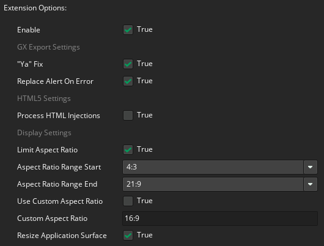

# NOGX
An extension for **Game Maker** designed to to make it easier to develop web games using the **GX target**.  
It removes the **GX platform** bindings in **GX target** replacing the `index.html` file, and also does other useful things.
> This extension can be useful even if you are not going to use GX target.

> Tested only on runtime `v2024.14.2.256` and `v2024.14.2.260`

### 1. Replacing `index.html` in GX target
The extension replaces the html file with its own `index.html`, which excludes bindings and functionality for the GX platform.
> The extension repackages the zip archive created for GX target.

### 2. Patching `runnner.js`
The extension fixes `runnner.js` to prevent errors or unwanted behavior on some web sites.
> `"Ya" Fix` and `Replace Alert On Error` options.

### 3. `webfiles` folder
This is a special folder in the root directory of your project where you can place web files.
The extension will include them in the **GX target** builds.
You can also use your custom `index.html` file located here, but it should be based on the default `index.html` file from the extension.

On GX builds, Included Files from `datafiles` that are set to export to **All** or **GX.games** are also copied into the HTML5 **Folder name** subfolder (Game Options → HTML5 → Folder name, default `html5game`), preserving the relative path under `datafiles`.  
`webfiles` are applied **after** that copy, so on path conflicts `webfiles` wins (for example `webfiles/html5game/icon.png` overrides the Included File).

### 4. send_async_event_social
The extension adds the ability to send `ev_async_social` from JS to GM for the **GX target**.
The interface is identical to the one in **HTML5**, namely:
`GMS_API.send_async_event_social(map)`

### 5. Screen size control (works in other targets, not just GX)
The extension manages the screen size within the specified aspect ratio constraints and also prevents image blur, even in an HTML5 target.

### 6. HTML-Injections (works on GX and HTML5)
The extension implements HTML code injection independently, ignoring Game Maker's implementation! Most injectors described in the [Game Maker manual page](https://manual.gamemaker.io/beta/en/The_Asset_Editors/Extension_Creation/HTML5_Extensions.htm) are supported.

> Even if your version of Game Maker has a broken built-in HTML injection mechanism, the extension will still do it.

### 7. Optional `runner.wasm` compression (GX and HTML5)
When the `Enable code compression` option is **on**, the extension can create a gzip-compressed binary file `runner.wbin` (compression level 7) using **7-Zip** and inject a custom `Module.instantiateWasm` loader into `index.html`.
The file keeps a `.wbin` extension on purpose: CDN/edge hosts often break `.gz` delivery, so the gzip stream is transported as opaque binary and decompressed manually in the browser.

On browsers with `DecompressionStream` and `WebAssembly.instantiateStreaming`, the loader decompresses and instantiates `runner.wbin` as a stream to minimize peak memory use. If native compressed streaming is unavailable or fails, it loads the original `runner.wasm` directly without a JavaScript decompression step.

The current GameMaker WASM runner requires WebAssembly Exception Handling. Minimum supported browser versions are Chrome and Android System WebView 95, Firefox 100, and Safari/iOS 15.2. Older engines cannot compile `runner.wasm`; this feature cannot be polyfilled by the loader. NOGX detects this before loading the runner and asks the user to update their browser or WebView.

When `Enable code compression` is **off**:
- `runner.wbin` is not created
- the wasm loader block is removed from `index.html` during pre-build
- the game uses the standard GameMaker `runner.wasm` loading path

If 7-Zip is not found or compression fails, the build continues — only a message is written to the log.

**7-Zip search order:**
1. Extension option `7-Zip Path`
2. Environment variables: `SEVEN_ZIP`, `7ZIP`, `7Z_HOME`, `7ZIP_HOME`
3. `C:\Program Files\7-Zip\7z.exe`
4. `C:\Program Files (x86)\7-Zip\7z.exe`

> For a custom `webfiles/index.html`, keep the `<!-- NOGX_CODE_COMPRESSION_START -->` / `<!-- NOGX_CODE_COMPRESSION_END -->` markers around the compression loader block so the option can enable or remove it automatically.

## Extension Options


## Functions
```gml
NOGX_get_canvas_width();
NOGX_get_canvas_height();
NOGX_get_pixel_ratio();
NOGX_is_ready();
```
`NOGX_is_ready()` returns the JS `__NOGX_ready` flag on **GX target** (becomes `true` after extension init). On other targets it returns `false`.

The last function will help you to fix incorrect `device_mouse_x_to_gui` and `device_mouse_y_to_gui` values on **HTML5 target**.  
Example:
```gml
// DRAW GUI EVENT
// draw touch points
for(var i=0; i<10; i++)
{
	var scl = NOGX_get_pixel_ratio(); // fix for HTML5 target
	draw_set_color(c_lime);
	if(device_mouse_check_button(i, mb_left)) {
		var px = device_mouse_x_to_gui(i) * scl;
		var py = device_mouse_y_to_gui(i) * scl;
		draw_circle(px, py, 16, false);
	}
}
```

## How to use
1. Add the extension to your project.
2. Set the extension settings you need.
3. Use `NOGX_get_canvas_width` and `NOGX_get_canvas_height` functions when controlling the size of the viewport and GUI size in your game.
4. When exporting the GX target game select the `Save locally as zip` option.   


